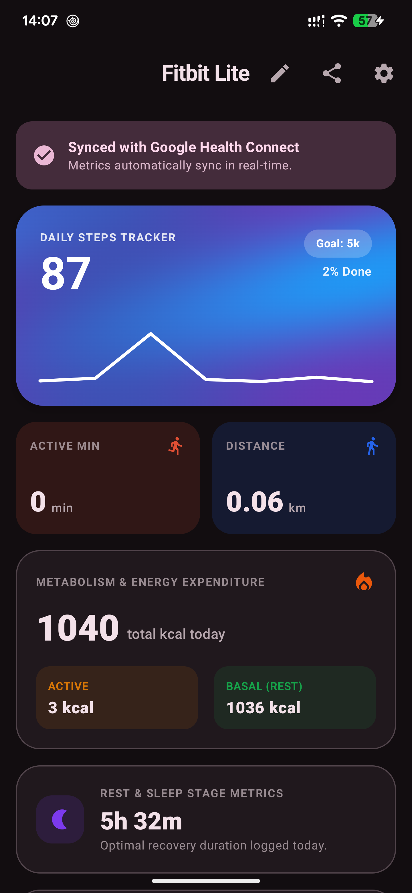
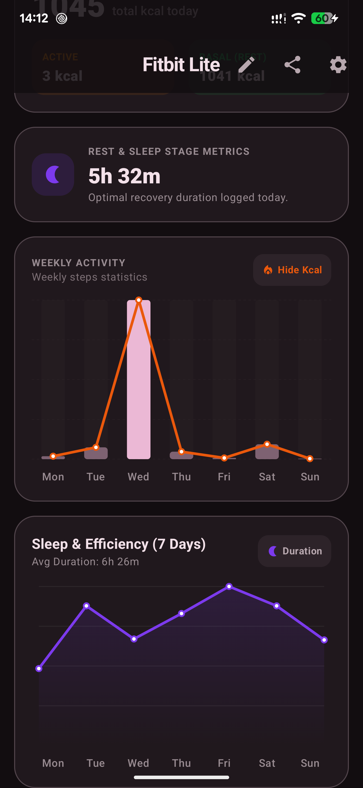
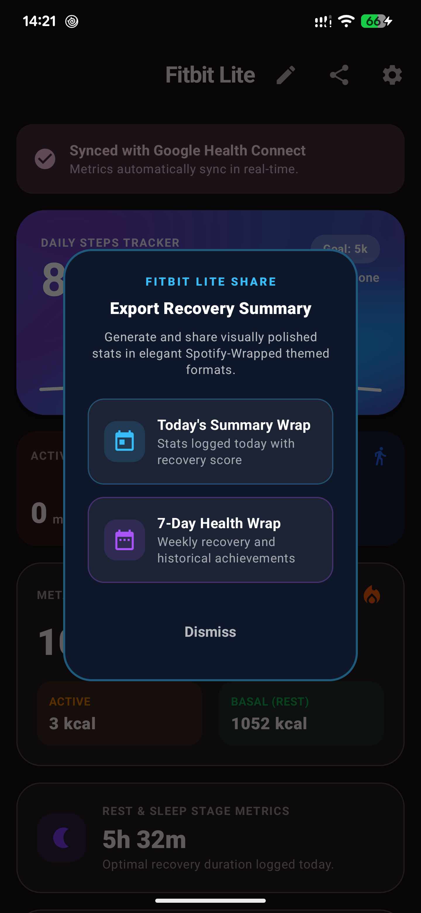
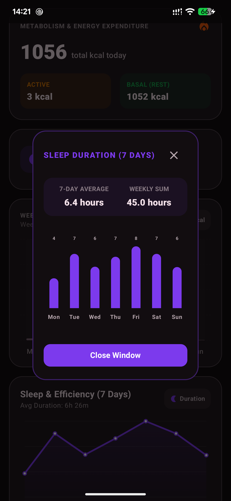
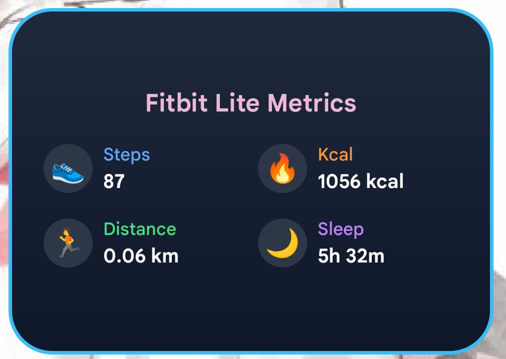

# Fitbit lite

Fully AI (Google AI Studio) generated Android app for show activity by Android Health Connet.

<table align="center">
	<tr>
		<td></td>
		<td width="10"></td>
		<td></td>
	</tr>
</table>

# Wraps and 7-day insight

<table align="center">
	<tr>
		<td></td>
		<td width="10"></td>
		<td></td>
	</tr>
</table>

# And home screen widget

> *Fitbit is a registered trademark of Google LLC. This project is not affiliated with, endorsed by, or sponsored by Google LLC.*
